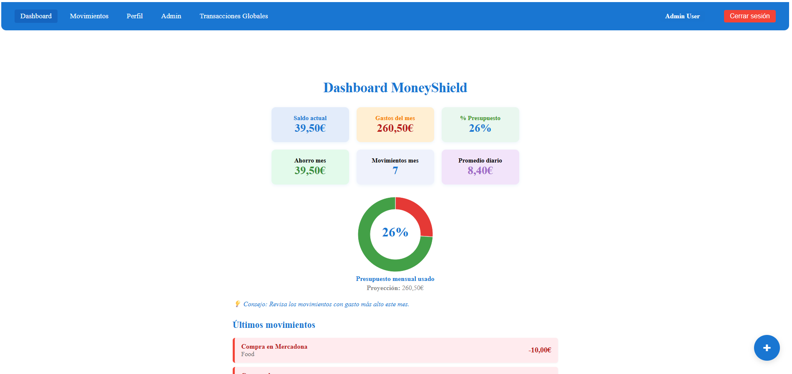

# MoneyShield Frontend (JCSC Version)

React + Vite frontend for personal finance management, designed to be the visual interface for the MoneyShield project.

---

## 🚀 Features

- Modern React (with hooks and functional components)
- Modular and clean architecture (components, context, services)
- Secure authentication (JWT, private routes)
- KPI dashboard: real-time financial indicators (balance, monthly expenses, savings, budget, etc.) powered by backend API
- Expense/income registration with categories and descriptions
- Responsive design: optimized for desktop and mobile
- Visual alerts and feedback to improve user experience
- API service layer with Axios, fully decoupled from backend
- Clean CSS, custom styles and user-friendly UI

---

## 📦 Installation

**Clone the repo and install dependencies:**
```
git clone https://github.com/JCSC79/Proyecto_MoneyShield_JCSC.git
cd Proyecto_MoneyShield_JCSC/frontend
npm install
```


---

## ⚙️ Configuration

- By default, the frontend connects to the backend API running at `http://localhost:3000`.
- If you need to change the API URL (for testing or deployment), create a `.env` file in the `frontend` folder:
    ```
    VITE_API_URL=http://your-backend-url:3000
    ```
- Make sure the backend is running before starting the frontend.

---

## 🏃‍♂️ Usage

**Start the development server:**

```
npm run dev
```


The app will be available at: [http://localhost:5173](http://localhost:5173)

---

## 💻 Main Screens

- **Dashboard:** Central area with real-time KPIs and donut chart of budget usage.
- **Movements:** List of recent transactions, filterable by category and date.
- **Forms:** Register new incomes or expenses with clear validation.
- **Admin area:** (If logged as admin) search, block, and edit users or transactions.
- **Responsive mode:** All features adapt for mobile display.

> **Tip:** All business calculations (KPIs, budget %, etc) are done in the backend; the frontend is only responsible for displaying data and sending user actions.

---

## 📸 Screenshot



*(You can replace this path with the actual screenshot in your `doc/` folder)*

---

## 👤 Default Users for Testing

**Admin**
- Email: `admin@money.com`
- Password: `3lManduc0.56`

**Normal User**
- Email: `user@money.com`
- Password: `3lManduc0.56`

---

## 🔄 API Integration

- All data is fetched and sent to the backend via the service layer (`/src/services/movimientos.api.js`).
- Secure endpoints require JWT authentication (token is stored safely on login).
- Documentation about the API is available at the backend (`/api-docs` via Swagger).

---

## 🗂️ Project Structure (main folders)

```
frontend/
    node_modules/
    public/
        favicon.ico
    src/
        components/
            AdminLayout.jsx
            AdminModal.jsx
            AdminPagination.jsx
            Alert.jsx
            BudgetPieChart.jsx
            Button.jsx
            Input.jsx
            Navbar.jsx
        contexts/
            AuthContext.jsx
        pages/
            AdminDashboard.jsx
            Dashboard.jsx
            Login.jsx
            Movimientos.jsx
            Perfil.jsx
            Registro.jsx
            TransactionsList.jsx
            UserDetailModal.jsx
            UserList.jsx
        services/
            auth.api.js
            axios.js
            categories.api.js
            movimientos.api.js
            users.api.js
        styles/
            admin.css
            Dashboard.css
            Form.css
            Navbar.css
        App.jsx
        index.css
        main.jsx
    eslint.config.js
    index.html
    package.json
    package-lock.json
    README.md
    vite.config.js
```

---

## 🧑‍💻 Developer Tips

- Use `npm run build` to build for production.
- You can customize styles in `/src/styles/`.
- For service endpoints, check `/src/services/movimientos.api.js`.
- If you add new environment variables, always restart the dev server.

---

## 📄 License

This project is licensed under the MIT License – see the [LICENSE](../LICENSE) file for details.

---

## 📚 Español

Interfaz frontend de MoneyShield desarrollada en React + Vite.

- Para instalar, entra en `/frontend` y ejecuta:
    ```
    npm install
    npm run dev
    ```
- La app se conecta al backend en el puerto 3000 por defecto.
- Puedes editar la URL de la API mediante un archivo `.env` con la variable `VITE_API_URL`.

Más detalles y capturas están disponibles en la carpeta `/doc/`.

---

Created by Juan Carlos Sandomingo for MoneyShield © 2025.
Current date: Thursday, July 31, 2025, 10:00 AM

